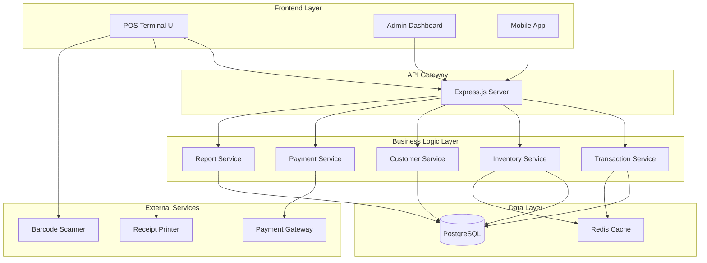
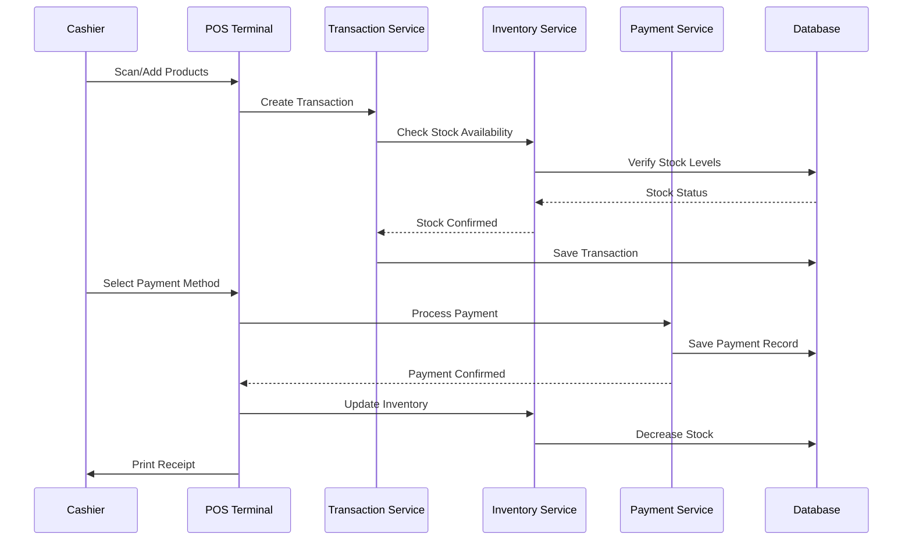
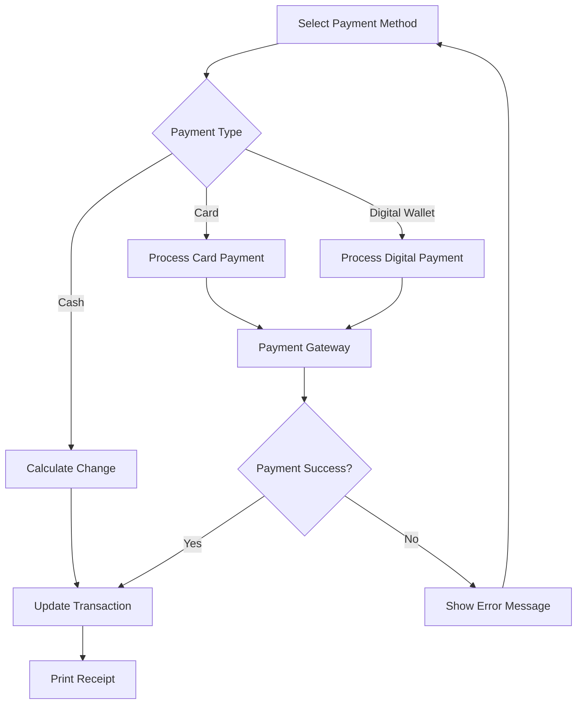
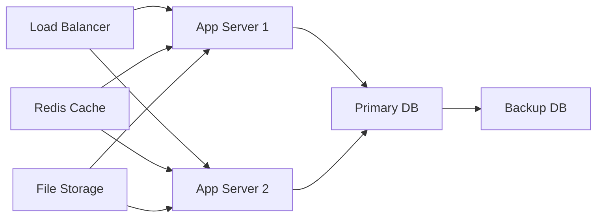

# POS System Development Design

## Overview

This document outlines the design and development plan for a comprehensive Point of Sale (POS) system. The system will handle retail transactions, inventory management, customer relationships, and business analytics for retail establishments.

### Key Features
- Sales Transaction Processing
- Inventory Management
- Customer Management
- Payment Processing
- Reporting & Analytics
- User Management & Access Control
- Multi-location Support

### Technology Stack
- **Frontend**: React.js with TypeScript
- **Backend**: Node.js with Express.js
- **Database**: PostgreSQL
- **Payment Gateway**: Stripe/Square integration
- **Authentication**: JWT-based auth
- **Real-time Updates**: Socket.io

## Architecture

### System Architecture Diagram



### Component Architecture

#### Frontend Components
- **POS Terminal**
  - Product Search & Selection
  - Cart Management
  - Payment Processing Interface
  - Receipt Generation
- **Admin Dashboard**
  - Inventory Management
  - Sales Reports
  - User Management
  - System Configuration
- **Mobile Interface**
  - Quick Sale Entry
  - Inventory Lookup
  - Customer Management

#### Backend Services
- **Authentication Service**: JWT token management
- **Transaction Service**: Process sales and returns
- **Inventory Service**: Stock management and tracking
- **Customer Service**: Customer data and loyalty programs
- **Payment Service**: Payment gateway integration
- **Reporting Service**: Analytics and business intelligence

## Data Models & Database Schema

### Core Tables

#### Transaction Tables (PST prefix - POS Transaction)
```sql
-- Transaction Master
PSTM_Transaction (
    transaction_id SERIAL PRIMARY KEY,
    store_id INTEGER,
    terminal_id INTEGER,
    cashier_id INTEGER,
    customer_id INTEGER,
    transaction_date TIMESTAMP,
    total_amount DECIMAL(10,2),
    tax_amount DECIMAL(10,2),
    discount_amount DECIMAL(10,2),
    payment_method VARCHAR(50),
    status VARCHAR(20),
    created_at TIMESTAMP
);

-- Transaction Items
PSTT_TransactionItems (
    item_id SERIAL PRIMARY KEY,
    transaction_id INTEGER,
    product_id INTEGER,
    quantity INTEGER,
    unit_price DECIMAL(10,2),
    total_price DECIMAL(10,2),
    discount_applied DECIMAL(10,2)
);
```

#### Product Master Tables (PSM prefix - POS Master)
```sql
-- Products
PSMP_Products (
    product_id SERIAL PRIMARY KEY,
    sku VARCHAR(50) UNIQUE,
    name VARCHAR(200),
    description TEXT,
    category_id INTEGER,
    price DECIMAL(10,2),
    cost DECIMAL(10,2),
    barcode VARCHAR(50),
    is_active BOOLEAN,
    created_at TIMESTAMP
);

-- Categories
PSMC_Categories (
    category_id SERIAL PRIMARY KEY,
    name VARCHAR(100),
    parent_id INTEGER,
    is_active BOOLEAN
);

-- Inventory
PSMI_Inventory (
    inventory_id SERIAL PRIMARY KEY,
    product_id INTEGER,
    store_id INTEGER,
    current_stock INTEGER,
    minimum_stock INTEGER,
    maximum_stock INTEGER,
    last_updated TIMESTAMP
);
```

#### Customer Master (PSM prefix)
```sql
-- Customers
PSMC_Customers (
    customer_id SERIAL PRIMARY KEY,
    first_name VARCHAR(100),
    last_name VARCHAR(100),
    email VARCHAR(200),
    phone VARCHAR(20),
    address TEXT,
    loyalty_points INTEGER DEFAULT 0,
    created_at TIMESTAMP
);
```

#### System Tables (PSS prefix - POS System)
```sql
-- Users/Staff
PSSS_Users (
    user_id SERIAL PRIMARY KEY,
    username VARCHAR(50) UNIQUE,
    password_hash VARCHAR(255),
    role VARCHAR(20),
    store_id INTEGER,
    is_active BOOLEAN,
    created_at TIMESTAMP
);

-- Stores
PSSS_Stores (
    store_id SERIAL PRIMARY KEY,
    name VARCHAR(200),
    address TEXT,
    phone VARCHAR(20),
    tax_rate DECIMAL(5,2),
    is_active BOOLEAN
);
```

## API Endpoints Reference

### Transaction Endpoints
```
POST   /api/transactions           # Create new transaction
GET    /api/transactions/:id       # Get transaction details
PUT    /api/transactions/:id       # Update transaction
POST   /api/transactions/:id/void  # Void transaction
GET    /api/transactions           # List transactions with filters
```

### Product Management
```
GET    /api/products               # List products
POST   /api/products               # Create product
PUT    /api/products/:id           # Update product
DELETE /api/products/:id           # Delete product
GET    /api/products/search        # Search products by name/SKU/barcode
```

### Inventory Management
```
GET    /api/inventory              # Current inventory levels
POST   /api/inventory/adjustment   # Adjust stock levels
GET    /api/inventory/low-stock    # Products below minimum stock
POST   /api/inventory/transfer     # Transfer between stores
```

### Customer Management
```
GET    /api/customers              # List customers
POST   /api/customers              # Create customer
PUT    /api/customers/:id          # Update customer
GET    /api/customers/search       # Search customers
POST   /api/customers/:id/loyalty  # Add loyalty points
```

### Payment Processing
```
POST   /api/payments/process       # Process payment
POST   /api/payments/refund        # Process refund
GET    /api/payments/methods       # Available payment methods
```

### Reporting
```
GET    /api/reports/daily-sales    # Daily sales report
GET    /api/reports/inventory      # Inventory report
GET    /api/reports/top-products   # Best selling products
GET    /api/reports/cashier        # Cashier performance
```

## Business Logic Layer

### Transaction Processing Flow



### Inventory Management Logic
- **Stock Level Monitoring**: Automatic alerts for low stock
- **Reorder Point Calculation**: Based on sales velocity
- **Multi-location Inventory**: Track stock across stores
- **Stock Adjustments**: Manual adjustments with audit trail

### Customer Management Logic
- **Loyalty Points System**: Points earned per purchase
- **Customer History**: Purchase history and preferences
- **Discounts & Promotions**: Customer-specific pricing

## Authentication & Authorization

### User Roles
| Role | Permissions |
|------|-------------|
| **Admin** | Full system access, user management, reports |
| **Manager** | Store management, inventory, staff reports |
| **Cashier** | Transaction processing, customer lookup |
| **Inventory Staff** | Stock management, receiving |

### JWT Token Structure
```json
{
  "user_id": "123",
  "username": "cashier01",
  "role": "cashier", 
  "store_id": "1",
  "permissions": ["transaction.create", "customer.read"],
  "exp": 1234567890
}
```

## Payment Integration

### Supported Payment Methods
- **Cash**: Direct cash handling
- **Credit/Debit Cards**: Stripe/Square integration
- **Digital Wallets**: Apple Pay, Google Pay
- **Gift Cards**: Internal gift card system
- **Store Credit**: Customer account balance

### Payment Flow


## Testing Strategy

### Unit Testing
- **Service Layer Tests**: Business logic validation
- **API Endpoint Tests**: Request/response validation
- **Database Tests**: Data integrity and constraints
- **Payment Tests**: Mock payment gateway responses

### Integration Testing
- **End-to-End Workflows**: Complete transaction flows
- **External Service Integration**: Payment gateway testing
- **Database Integration**: Multi-table operations
- **Authentication Flow**: Login and permission testing

### Test Coverage Requirements
- Minimum 80% code coverage
- All critical paths tested
- Error handling scenarios covered
- Edge cases for inventory and payments

## Performance Considerations

### Database Optimization
- **Indexing Strategy**: Indexes on frequently queried fields
- **Query Optimization**: Efficient joins and aggregations
- **Connection Pooling**: Database connection management
- **Caching**: Redis for frequently accessed data

### Frontend Performance
- **Component Optimization**: React.memo and useMemo
- **Lazy Loading**: Code splitting for admin features
- **Local State Management**: Minimize API calls
- **Offline Capability**: Local storage for basic operations

## Security Measures

### Data Protection
- **Encryption**: Sensitive data encryption at rest
- **Secure Communication**: HTTPS/TLS for all API calls
- **PCI Compliance**: Payment card industry standards
- **Access Logging**: Audit trail for all transactions

### Application Security
- **Input Validation**: Sanitize all user inputs
- **SQL Injection Prevention**: Parameterized queries
- **XSS Protection**: Content Security Policy
- **Rate Limiting**: API endpoint protection

## Deployment Architecture

### Production Environment


### Environment Configuration
- **Development**: Local development setup
- **Staging**: Pre-production testing environment
- **Production**: High-availability production setup

## Monitoring & Maintenance

### System Monitoring
- **Application Performance**: Response times and errors
- **Database Performance**: Query performance and locks
- **Server Resources**: CPU, memory, disk usage
- **Business Metrics**: Sales volume, transaction success rates

### Backup Strategy
- **Database Backups**: Daily automated backups
- **File Backups**: Receipt images and logs
- **Disaster Recovery**: Cross-region backup storage
- **Recovery Testing**: Regular restore procedure testing